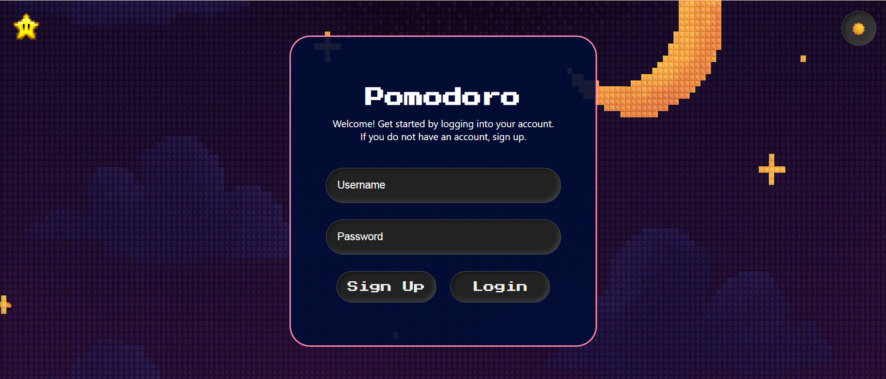

# ⏱️ Pomodoro – Task & Productivity Manager 🌸

**Pomodoro** is a beautifully crafted web application that combines time management, goal setting, and productivity tracking using the **Pomodoro Technique**. Developed as a **Database Systems course project**, this app helps users stay focused while managing tasks and visualizing their progress through goal-based tracking.

---

## 📚 About the Project

This project showcases practical implementation of:
- **Relational database design**
- **Full-stack web development**
- **User-centered design**

Pomodoro empowers users to:
- Log focused work sessions
- Track and manage tasks by priority
- Set and achieve personal goals
- Monitor progress through a visual progress bar

---

## ✨ Key Features

| Feature | Description |
|--------|-------------|
| 👤 **User Authentication** | Secure signup and login with session-based authentication |
| 📋 **Task Manager** | Create, edit, delete tasks with priorities (High, Medium, Low) |
| ⏱️ **Pomodoro Timer** | Start work sessions with built-in short and long breaks |
| 🎯 **Goal Tracking** | Set personal goals and watch your progress bar move as you achieve them |
| 📜 **Session Logging** | All sessions are recorded in the database for history tracking |
| 🌙 **Dark Mode** | Toggle between light and dark themes to suit your environment |
| 🌸 **Elegant UI** | Calming pink floral theme with notepad-style layout for enhanced focus |

---

## 🖼️ Screenshots

### 🌼 Home 

### 🌙 Dark Mode View

---

## 🧠 Entity-Relationship (ER) Diagram

This ER diagram visualizes the relational structure of the database used in Pomodoro:

---

## 🗃️ Database Design

### 📂 Database Name: `pomodoro_task_manager`

#### 🔐 `users`
- `user_id` (PK)
- `username`
- `password_hash`
- `created_at`

#### 📋 `tasks`
- `task_id` (PK)
- `user_id` (FK)
- `title`
- `priority` (`High`, `Medium`, `Low`)
- `sessions` (number of Pomodoro sessions required)
- `notes`

#### ⏱️ `sessions`
- `session_id` (PK)
- `user_id` (FK)
- `task_id` (FK)
- `session_type` (`Work`, `Short Break`, `Long Break`)
- `duration`
- `custom_work_duration`
- `custom_break_duration`
- `timestamp`

#### 📜 `history`
- `history_id` (PK)
- `user_id` (FK)
- `session_id` (FK)
- `task_id` (FK)
- `task_name`
- `session_type`
- `duration`
- `timestamp`

#### 🎯 `goals`
- `goal_id` (PK)
- `user_id` (FK)
- `goal_text`
- `is_achieved` (Boolean)
- `created_at`
- `achieved_at` (nullable)

---

